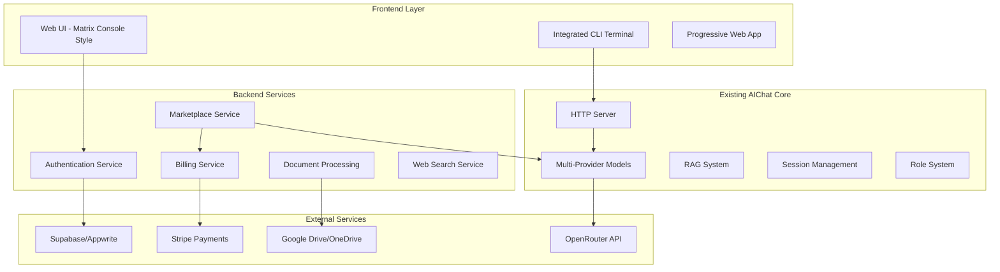
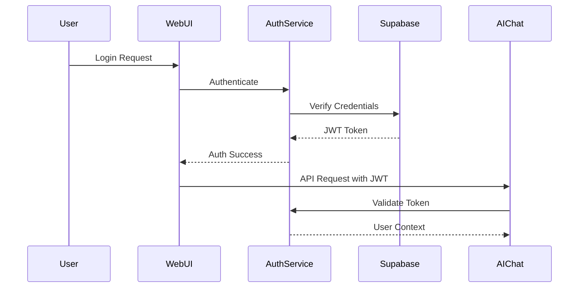
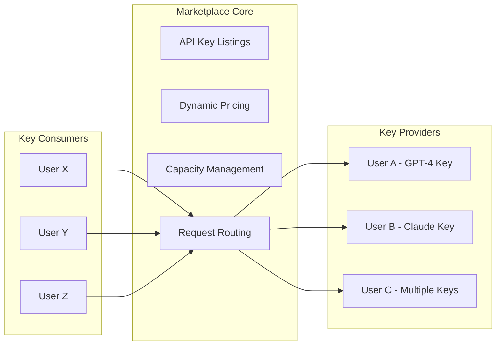
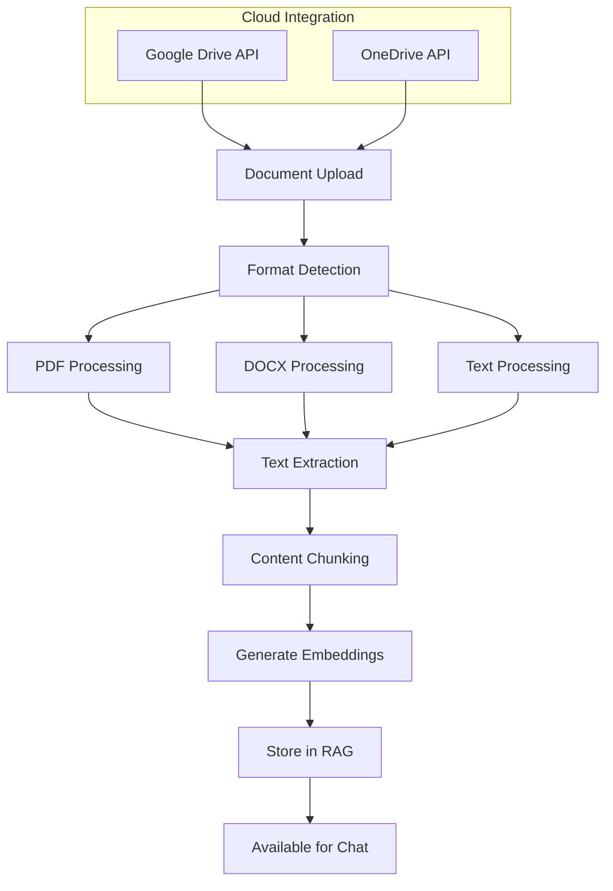

# Design Document

## Overview

This design document outlines the transformation of the existing aichat CLI tool into a comprehensive web-based graphical environment with Matrix console aesthetics. The solution will leverage aichat's existing Rust backend infrastructure while adding a modern web frontend that incorporates marketplace functionality, authentication, document processing, and peer-to-peer billing.

The architecture maintains aichat's core strengths (multi-provider support, local server capabilities, RAG, sessions, roles) while extending it with web-based user management, API key marketplace, cloud integrations, and a Matrix-inspired user interface that seamlessly blends terminal and graphical elements.

## Architecture

### High-Level Architecture



### Technology Stack Integration

**Frontend Technologies:**
- **Base Framework**: Enhanced HTML/CSS/JavaScript (building on existing enhanced-gui.html)
- **Matrix Console Styling**: Custom CSS with terminal aesthetics, green-on-black color schemes
- **Terminal Emulator**: xterm.js for integrated CLI functionality
- **Real-time Communication**: WebSockets for live AI responses and terminal interaction
- **Progressive Web App**: Service workers for offline capability and native app experience

**Backend Extensions:**
- **Authentication**: Supabase/Appwrite integration with existing Rust server
- **Database**: PostgreSQL via Supabase for user data, marketplace, billing
- **Payment Processing**: Stripe API integration for marketplace transactions
- **Cloud Storage**: Google Drive and OneDrive API integration
- **Web Search**: DuckDuckGo and Google Search API integration

**Infrastructure:**
- **Existing AIChat Server**: Extended with new endpoints for marketplace, auth, billing
- **Database Schema**: User management, API key marketplace, billing, analytics
- **Security**: JWT tokens, API key encryption, rate limiting, CORS configuration

## Components and Interfaces

### 1. Matrix Console Web Interface

**Design Philosophy:**
- Matrix-inspired terminal aesthetic with green text on black backgrounds
- Seamless integration of graphical UI elements within console theme
- Typewriter animations for text rendering
- Retro terminal fonts (Courier New, Monaco, Consolas)
- Glitch effects and scan lines for authentic Matrix feel

**Core Components:**

```typescript
interface MatrixConsoleTheme {
  colors: {
    primary: '#00ff00',      // Matrix green
    secondary: '#008000',    // Darker green
    background: '#000000',   // Pure black
    text: '#00ff00',        // Green text
    accent: '#ffffff',      // White highlights
    error: '#ff0000',       // Red for errors
    warning: '#ffff00'      // Yellow for warnings
  },
  fonts: {
    primary: 'Courier New, Monaco, Consolas',
    size: '14px',
    lineHeight: '1.4'
  },
  effects: {
    typewriter: true,
    scanLines: true,
    glitch: false,
    crtCurvature: false
  }
}
```

**Layout Structure:**
- **Header**: Matrix-style title with animated text effects
- **Sidebar**: Console-style navigation with ASCII art elements
- **Main Area**: Chat interface with terminal-style message rendering
- **Terminal Panel**: Integrated CLI access via xterm.js
- **Status Bar**: System information in terminal format

### 2. Authentication and User Management System

**Authentication Flow:**


**User Profile Schema:**
```sql
CREATE TABLE users (
  id UUID PRIMARY KEY DEFAULT gen_random_uuid(),
  email VARCHAR(255) UNIQUE NOT NULL,
  username VARCHAR(50) UNIQUE NOT NULL,
  encrypted_api_keys JSONB DEFAULT '{}',
  subscription_tier VARCHAR(20) DEFAULT 'free',
  usage_limits JSONB DEFAULT '{}',
  created_at TIMESTAMP DEFAULT NOW(),
  updated_at TIMESTAMP DEFAULT NOW()
);

CREATE TABLE user_sessions (
  id UUID PRIMARY KEY DEFAULT gen_random_uuid(),
  user_id UUID REFERENCES users(id),
  session_data JSONB,
  created_at TIMESTAMP DEFAULT NOW(),
  updated_at TIMESTAMP DEFAULT NOW()
);
```

### 3. API Key Marketplace System

**Marketplace Architecture:**


**Marketplace Data Models:**
```sql
CREATE TABLE api_key_listings (
  id UUID PRIMARY KEY DEFAULT gen_random_uuid(),
  provider_user_id UUID REFERENCES users(id),
  provider_name VARCHAR(50) NOT NULL, -- 'openrouter', 'openai', etc.
  encrypted_api_key TEXT NOT NULL,
  base_price_multiplier DECIMAL(3,2) DEFAULT 1.20, -- 20% markup
  daily_limit_usd DECIMAL(10,2) DEFAULT 100.00,
  current_usage_usd DECIMAL(10,2) DEFAULT 0.00,
  is_active BOOLEAN DEFAULT true,
  supported_models JSONB DEFAULT '[]',
  created_at TIMESTAMP DEFAULT NOW()
);

CREATE TABLE marketplace_transactions (
  id UUID PRIMARY KEY DEFAULT gen_random_uuid(),
  consumer_user_id UUID REFERENCES users(id),
  provider_user_id UUID REFERENCES users(id),
  listing_id UUID REFERENCES api_key_listings(id),
  model_used VARCHAR(100),
  tokens_consumed INTEGER,
  cost_usd DECIMAL(10,4),
  provider_earnings DECIMAL(10,4),
  platform_fee DECIMAL(10,4),
  created_at TIMESTAMP DEFAULT NOW()
);
```

### 4. Integrated Terminal Interface

**Terminal Integration:**
- **xterm.js**: Full-featured terminal emulator in the browser
- **WebSocket Connection**: Real-time communication with aichat CLI backend
- **Command Routing**: Direct access to all existing aichat CLI commands
- **Session Synchronization**: Sync between GUI and CLI sessions

**Terminal Component Architecture:**
```typescript
interface TerminalInterface {
  // Core terminal functionality
  terminal: Terminal;
  websocket: WebSocket;
  
  // Command handling
  executeCommand(command: string): Promise<string>;
  handleCliOutput(output: string): void;
  
  // Session management
  syncWithGUI(): void;
  loadSession(sessionId: string): void;
  
  // Matrix styling
  applyMatrixTheme(): void;
  enableTypewriterEffect(): void;
}
```

### 5. Multi-Provider Chat Interface

**Enhanced Chat System:**
```typescript
interface MultiProviderChat {
  // Provider management
  activeProviders: string[];
  providerConfigs: Map<string, ProviderConfig>;
  
  // Chat functionality
  sendToAllProviders(message: string): Promise<Response[]>;
  displaySideBySideResponses(responses: Response[]): void;
  
  // Cost tracking
  calculateCostPerProvider(usage: Usage[]): CostBreakdown;
  displayRealTimeCosts(): void;
  
  // Matrix UI integration
  renderInMatrixStyle(content: string): HTMLElement;
  animateResponse(text: string): void;
}
```

### 6. Document Processing and Cloud Integration

**Document Processing Pipeline:**


**Cloud Storage Integration:**
```typescript
interface CloudStorageService {
  // Google Drive integration
  authenticateGoogleDrive(): Promise<void>;
  listGoogleDriveFiles(): Promise<DriveFile[]>;
  downloadFromGoogleDrive(fileId: string): Promise<Blob>;
  
  // OneDrive integration
  authenticateOneDrive(): Promise<void>;
  listOneDriveFiles(): Promise<OneDriveFile[]>;
  downloadFromOneDrive(fileId: string): Promise<Blob>;
  
  // Unified interface
  processCloudDocument(source: 'gdrive' | 'onedrive', fileId: string): Promise<void>;
}
```

## Data Models

### User Management Schema

```sql
-- Core user table
CREATE TABLE users (
  id UUID PRIMARY KEY DEFAULT gen_random_uuid(),
  email VARCHAR(255) UNIQUE NOT NULL,
  username VARCHAR(50) UNIQUE NOT NULL,
  password_hash VARCHAR(255) NOT NULL,
  encrypted_api_keys JSONB DEFAULT '{}',
  subscription_tier VARCHAR(20) DEFAULT 'free',
  usage_limits JSONB DEFAULT '{"daily_requests": 100, "monthly_spend": 50}',
  preferences JSONB DEFAULT '{"theme": "matrix", "terminal_enabled": true}',
  created_at TIMESTAMP DEFAULT NOW(),
  updated_at TIMESTAMP DEFAULT NOW()
);

-- User sessions and chat history
CREATE TABLE chat_sessions (
  id UUID PRIMARY KEY DEFAULT gen_random_uuid(),
  user_id UUID REFERENCES users(id),
  session_name VARCHAR(100),
  messages JSONB DEFAULT '[]',
  context_data JSONB DEFAULT '{}',
  created_at TIMESTAMP DEFAULT NOW(),
  updated_at TIMESTAMP DEFAULT NOW()
);

-- Document storage and processing
CREATE TABLE user_documents (
  id UUID PRIMARY KEY DEFAULT gen_random_uuid(),
  user_id UUID REFERENCES users(id),
  filename VARCHAR(255) NOT NULL,
  file_type VARCHAR(50),
  file_size INTEGER,
  cloud_source VARCHAR(20), -- 'gdrive', 'onedrive', 'upload'
  cloud_file_id VARCHAR(255),
  processed_content TEXT,
  embeddings_generated BOOLEAN DEFAULT false,
  created_at TIMESTAMP DEFAULT NOW()
);
```

### Marketplace and Billing Schema

```sql
-- API key marketplace
CREATE TABLE api_key_listings (
  id UUID PRIMARY KEY DEFAULT gen_random_uuid(),
  provider_user_id UUID REFERENCES users(id),
  provider_name VARCHAR(50) NOT NULL,
  encrypted_api_key TEXT NOT NULL,
  key_name VARCHAR(100),
  base_price_multiplier DECIMAL(3,2) DEFAULT 1.20,
  daily_limit_usd DECIMAL(10,2) DEFAULT 100.00,
  monthly_limit_usd DECIMAL(10,2) DEFAULT 1000.00,
  current_daily_usage DECIMAL(10,2) DEFAULT 0.00,
  current_monthly_usage DECIMAL(10,2) DEFAULT 0.00,
  is_active BOOLEAN DEFAULT true,
  supported_models JSONB DEFAULT '[]',
  performance_metrics JSONB DEFAULT '{}',
  created_at TIMESTAMP DEFAULT NOW(),
  updated_at TIMESTAMP DEFAULT NOW()
);

-- Transaction tracking
CREATE TABLE marketplace_transactions (
  id UUID PRIMARY KEY DEFAULT gen_random_uuid(),
  consumer_user_id UUID REFERENCES users(id),
  provider_user_id UUID REFERENCES users(id),
  listing_id UUID REFERENCES api_key_listings(id),
  model_used VARCHAR(100),
  prompt_tokens INTEGER,
  completion_tokens INTEGER,
  total_tokens INTEGER,
  base_cost_usd DECIMAL(10,4),
  markup_cost_usd DECIMAL(10,4),
  total_cost_usd DECIMAL(10,4),
  provider_earnings DECIMAL(10,4),
  platform_fee DECIMAL(10,4),
  transaction_type VARCHAR(20) DEFAULT 'chat_completion',
  created_at TIMESTAMP DEFAULT NOW()
);

-- Billing and payments
CREATE TABLE user_billing (
  id UUID PRIMARY KEY DEFAULT gen_random_uuid(),
  user_id UUID REFERENCES users(id),
  stripe_customer_id VARCHAR(100),
  current_balance DECIMAL(10,2) DEFAULT 0.00,
  total_spent DECIMAL(10,2) DEFAULT 0.00,
  total_earned DECIMAL(10,2) DEFAULT 0.00,
  payment_methods JSONB DEFAULT '[]',
  billing_address JSONB DEFAULT '{}',
  created_at TIMESTAMP DEFAULT NOW(),
  updated_at TIMESTAMP DEFAULT NOW()
);
```

### Analytics and Reporting Schema

```sql
-- Usage analytics
CREATE TABLE usage_analytics (
  id UUID PRIMARY KEY DEFAULT gen_random_uuid(),
  user_id UUID REFERENCES users(id),
  date DATE NOT NULL,
  requests_count INTEGER DEFAULT 0,
  tokens_consumed INTEGER DEFAULT 0,
  cost_usd DECIMAL(10,4) DEFAULT 0.00,
  models_used JSONB DEFAULT '{}',
  session_duration_minutes INTEGER DEFAULT 0,
  created_at TIMESTAMP DEFAULT NOW()
);

-- System-wide metrics
CREATE TABLE system_metrics (
  id UUID PRIMARY KEY DEFAULT gen_random_uuid(),
  date DATE NOT NULL,
  total_users INTEGER DEFAULT 0,
  active_users INTEGER DEFAULT 0,
  total_requests INTEGER DEFAULT 0,
  total_revenue DECIMAL(10,2) DEFAULT 0.00,
  marketplace_transactions INTEGER DEFAULT 0,
  average_response_time_ms INTEGER DEFAULT 0,
  created_at TIMESTAMP DEFAULT NOW()
);
```

## Error Handling

### Error Classification and Response Strategy

**1. Authentication Errors:**
- Invalid credentials → Redirect to login with clear error message
- Expired tokens → Automatic refresh or re-authentication prompt
- Insufficient permissions → Display access denied with upgrade options

**2. API Key Marketplace Errors:**
- Key capacity exceeded → Automatic failover to alternative keys
- Invalid API keys → Remove from marketplace, notify provider
- Payment failures → Suspend access, provide payment resolution steps

**3. AI Provider Errors:**
- Rate limiting → Queue requests and retry with exponential backoff
- Model unavailable → Suggest alternative models or providers
- Context length exceeded → Automatic context summarization

**4. Document Processing Errors:**
- Unsupported format → Display supported formats and conversion options
- File too large → Implement chunking or size limit warnings
- Cloud access denied → Re-authentication flow for cloud services

**5. Terminal Integration Errors:**
- WebSocket disconnection → Automatic reconnection with session restoration
- Command execution failures → Display error in terminal with suggestions
- CLI synchronization issues → Manual sync option with conflict resolution

### Error Response Format

```typescript
interface ErrorResponse {
  error: {
    code: string;
    message: string;
    details?: any;
    suggestions?: string[];
    retryable: boolean;
  };
  timestamp: string;
  requestId: string;
}
```

## Testing Strategy

### 1. Unit Testing

**Frontend Components:**
- Matrix console theme rendering and animations
- Terminal emulator integration and command handling
- Multi-provider chat interface functionality
- Document upload and processing workflows
- Authentication and session management

**Backend Services:**
- API key marketplace logic and routing
- Billing and payment processing
- User authentication and authorization
- Document processing and cloud integration
- Analytics and reporting generation

### 2. Integration Testing

**End-to-End Workflows:**
- Complete user registration and onboarding flow
- API key listing and marketplace transaction flow
- Document upload, processing, and chat integration
- Multi-provider chat with cost tracking
- Terminal CLI integration with GUI synchronization

**External Service Integration:**
- Supabase/Appwrite authentication flows
- Stripe payment processing and webhooks
- Google Drive and OneDrive API integration
- OpenRouter and other AI provider APIs
- Web search API integration (DuckDuckGo, Google)

### 3. Performance Testing

**Load Testing Scenarios:**
- Concurrent user sessions and chat interactions
- Marketplace transaction processing under load
- Document processing with large files
- Real-time terminal command execution
- WebSocket connection stability

**Scalability Testing:**
- Database performance with growing user base
- API key routing efficiency at scale
- Memory usage with multiple active sessions
- Response times under various load conditions

### 4. Security Testing

**Authentication and Authorization:**
- JWT token security and expiration handling
- API key encryption and secure storage
- User data privacy and access controls
- Payment information security (PCI compliance)

**Input Validation and Sanitization:**
- File upload security and malware scanning
- Command injection prevention in terminal
- SQL injection prevention in database queries
- XSS prevention in chat message rendering

### 5. User Experience Testing

**Matrix Console Aesthetics:**
- Theme consistency across different browsers
- Animation performance and visual effects
- Accessibility compliance with screen readers
- Mobile responsiveness and touch interactions

**Usability Testing:**
- New user onboarding experience
- Marketplace discovery and transaction flow
- Document processing and chat integration
- Terminal and GUI mode switching

### Testing Tools and Frameworks

**Frontend Testing:**
- Jest for unit testing JavaScript components
- Cypress for end-to-end testing workflows
- Lighthouse for performance and accessibility auditing
- Browser compatibility testing across major browsers

**Backend Testing:**
- Rust's built-in testing framework for core logic
- Integration tests for database operations
- API testing with Postman/Newman
- Load testing with Artillery or k6

**Security Testing:**
- OWASP ZAP for security vulnerability scanning
- Penetration testing for authentication flows
- Code analysis with security-focused linters
- Regular dependency vulnerability scanning